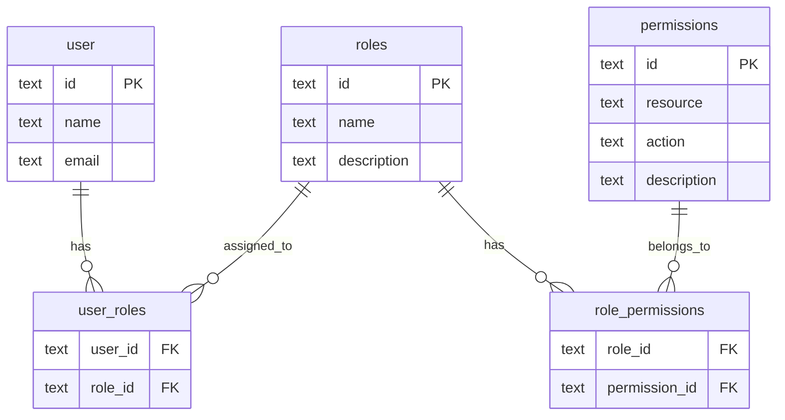

# Role-Based Access Control (RBAC) System

This document outlines the implementation and usage of the RBAC system in the ERP application.

## Overview

The RBAC system allows administrators to manage user permissions through roles. Permissions are granular actions on resources (e.g., `employees.create`), and roles are collections of permissions (e.g., `admin`, `hr`). Users are assigned one or more roles.

## Database Schema

The system uses four main tables:

- **`permissions`**: Defines all available permissions in the system.
- **`roles`**: Defines roles that can be assigned to users.
- **`role_permissions`**: Maps permissions to roles (Many-to-Many).
- **`user_roles`**: Maps roles to users (Many-to-Many).



## API

### Routers

The `rbac` router (`packages/api/src/routers/rbac.router.ts`) provides endpoints for managing roles and permissions:

- `listRoles`: Get all roles with their permissions.
- `createRole`: Create a new role.
- `updateRole`: Update an existing role and its permissions.
- `deleteRole`: Delete a role.
- `listPermissions`: Get all available permissions.
- `assignRole`: Assign a role to a user.
- `revokeRole`: Remove a role from a user.

### Middleware

A `requirePermission` middleware is available in `packages/api/src/index.ts`. It checks if the authenticated user has the specified permission through any of their assigned roles.

#### Usage

```typescript
import { requirePermission } from "@erp/api/index";

export const myRouter = {
  // Protect a procedure with a permission
  create: requirePermission("my_resource.create")
    .input(...)
    .handler(...),
};
```

## Frontend

### Roles Management

The Roles management page is located at `/settings/roles` (`apps/web/src/routes/(dashboard)/settings/roles.tsx`). It allows administrators to:

- View existing roles.
- Create new roles.
- Edit existing roles (change name, description, permissions).
- Delete roles.

### Role Form Dialog

The `RoleFormDialog` (`apps/web/src/routes/(dashboard)/settings/_components/role-form-dialog.tsx`) is used for creating and editing roles. It fetches available permissions from the API and allows selecting them via checkboxes.

## Adding New Permissions

To add a new permission to the system:

1.  Insert the permission into the `permissions` table in the database.

    ```sql
    INSERT INTO permissions (id, resource, action, description) VALUES ('new_resource.action', 'new_resource', 'action', 'Description');
    ```

    _Note: A seed script or migration should be used for this in production._

2.  Use the permission in your API router using `requirePermission('new_resource.action')`.
